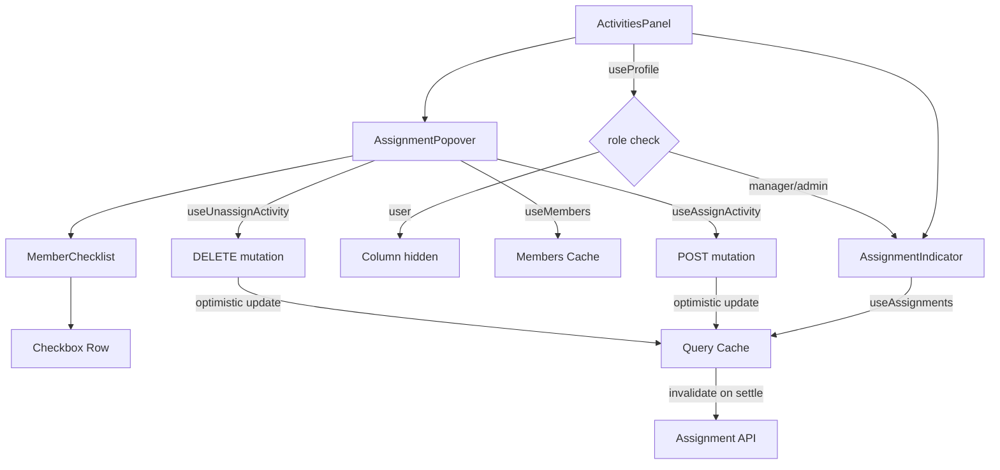

# Design Document: Activity Assignments

## Overview

Adds inline assignment management to the Activities table in the project edit page. A new "Assigned" column shows assignment count per activity, and clicking it opens a popover with a member checklist to toggle assignments on/off. The feature uses optimistic updates for snappy UX and is restricted to manager+ roles.

The design integrates with existing patterns: TanStack Query for server state, shadcn/ui Popover for the overlay, and the existing `useMembers` hook for the member roster.

## Architecture



**Data flow:**
1. `ActivitiesPanel` conditionally renders the "Assigned" column based on user role (via `useProfile`)
2. Each row's `AssignmentIndicator` fetches assignment count via `useAssignments(activityId)`
3. Clicking the indicator opens `AssignmentPopover`, which cross-references `useMembers` data with the activity's assignments
4. Checkbox toggles fire optimistic mutations that update the query cache immediately, then reconcile with the server

## Components and Interfaces

### New Hook: `useAssignments`

**File:** `src/hooks/use-assignments.ts`

```typescript
import { useQuery, useMutation, useQueryClient } from "@tanstack/react-query"
import { client } from "@/api/client"
import type { components } from "@/api/schema"

type AssignmentResponse = components["schemas"]["AssignmentResponse"]

export function useAssignments(activityId: string) {
  return useQuery({
    queryKey: ["assignments", activityId],
    queryFn: async () => {
      const { data, error } = await client.GET("/activities/{id}/assignments", {
        params: { path: { id: activityId } },
      })
      if (error) throw error
      return data
    },
  })
}

export function useAssignActivity(activityId: string) {
  const queryClient = useQueryClient()
  return useMutation({
    mutationFn: async (userId: string) => {
      const { data, error } = await client.POST("/activities/{id}/assignments", {
        params: { path: { id: activityId } },
        body: { userId },
      })
      if (error) throw error
      return data
    },
    onMutate: async (userId) => {
      await queryClient.cancelQueries({ queryKey: ["assignments", activityId] })
      const previous = queryClient.getQueryData<AssignmentResponse[]>(["assignments", activityId])
      queryClient.setQueryData<AssignmentResponse[]>(
        ["assignments", activityId],
        (old) => [...(old ?? []), { activityId, userId, assignedAt: new Date().toISOString() }]
      )
      return { previous }
    },
    onError: (_err, _userId, context) => {
      if (context?.previous) {
        queryClient.setQueryData(["assignments", activityId], context.previous)
      }
    },
    onSettled: () => {
      queryClient.invalidateQueries({ queryKey: ["assignments", activityId] })
    },
  })
}

export function useUnassignActivity(activityId: string) {
  const queryClient = useQueryClient()
  return useMutation({
    mutationFn: async (userId: string) => {
      const { error } = await client.DELETE("/activities/{id}/assignments/{userId}", {
        params: { path: { id: activityId, userId } },
      })
      if (error) throw error
    },
    onMutate: async (userId) => {
      await queryClient.cancelQueries({ queryKey: ["assignments", activityId] })
      const previous = queryClient.getQueryData<AssignmentResponse[]>(["assignments", activityId])
      queryClient.setQueryData<AssignmentResponse[]>(
        ["assignments", activityId],
        (old) => (old ?? []).filter((a) => a.userId !== userId)
      )
      return { previous }
    },
    onError: (_err, _userId, context) => {
      if (context?.previous) {
        queryClient.setQueryData(["assignments", activityId], context.previous)
      }
    },
    onSettled: () => {
      queryClient.invalidateQueries({ queryKey: ["assignments", activityId] })
    },
  })
}
```

### New Component: `AssignmentIndicator`

**File:** `src/components/manage/assignment-indicator.tsx`

```typescript
interface AssignmentIndicatorProps {
  activityId: string
  onClick: () => void
}
```

Renders:
- Loading: skeleton placeholder (non-interactive)
- Error: dash fallback
- Count 0: warning icon (AlertTriangle from Lucide) + "0" in amber
- Count > 0: Users icon (from Lucide) + numeric count

### New Component: `AssignmentPopover`

**File:** `src/components/manage/assignment-popover.tsx`

```typescript
interface AssignmentPopoverProps {
  activityId: string
  open: boolean
  onOpenChange: (open: boolean) => void
}
```

Contains:
- Member checklist (alphabetical by `displayName ?? email`)
- Optional search filter (shown when members > 10)
- Per-row loading/disabled state during in-flight mutations
- Inline error message if members API fails

### Modified Component: `ActivitiesPanel`

**File:** `src/components/manage/activities-panel.tsx`

Changes:
- Import `useProfile` to check role
- Conditionally render "Assigned" column header and cells
- Add `AssignmentIndicator` in each row cell
- Manage popover open state (which activityId is open)

## Data Models

### API Types (from schema.d.ts)

```typescript
// Already generated — no new types needed

type AssignmentResponse = {
  activityId: string
  userId: string
  assignedAt?: string | null
}

type AssignmentCreateRequest = {
  userId: string  // Format: uuid
}

type MemberResponse = {
  id: string
  email: string
  displayName?: string | null
  role: string
  // ...other fields not needed for this feature
}
```

### Query Keys

| Resource | Key Pattern | Invalidation Trigger |
|----------|-------------|---------------------|
| Assignments | `["assignments", activityId]` | Assign/unassign mutation settles |
| Members | `["members"]` | Not invalidated by this feature |
| Profile | `["profile"]` | Not invalidated by this feature |

### Optimistic Update Shape

On assign: append `{ activityId, userId, assignedAt: now }` to cached array.
On unassign: filter out the entry where `userId` matches.
On error: restore previous snapshot from `onMutate` context.

## Correctness Properties

*A property is a characteristic or behavior that should hold true across all valid executions of a system — essentially, a formal statement about what the system should do. Properties serve as the bridge between human-readable specifications and machine-verifiable correctness guarantees.*

### Property 1: Assignment count accuracy

*For any* array of AssignmentResponse items returned for an activity, the AssignmentIndicator SHALL display a numeric count equal to the array's length.

**Validates: Requirements 1.2, 2.3, 2.5**

### Property 2: Member list alphabetical ordering

*For any* set of MemberResponse items, the AssignmentPopover SHALL display them sorted alphabetically by `displayName` (case-insensitive), falling back to `email` when displayName is null.

**Validates: Requirements 3.2**

### Property 3: Checkbox state reflects assignment membership

*For any* member in the account roster and any set of current assignments for an activity, the member's checkbox SHALL be checked if and only if that member's userId exists in the assignments set.

**Validates: Requirements 3.3, 3.4**

### Property 4: Search filter visibility threshold

*For any* account member count N, the search filter input SHALL be rendered if and only if N > 10.

**Validates: Requirements 3.6**

### Property 5: Optimistic toggle consistency

*For any* assignment toggle action (assign or unassign), the checkbox state and cached assignment list SHALL immediately reflect the intended new state before the server responds.

**Validates: Requirements 4.1, 5.1, 7.3**

### Property 6: Count mutation delta

*For any* successful assignment creation, the displayed count SHALL equal the previous count plus one. *For any* successful assignment deletion, the displayed count SHALL equal the previous count minus one.

**Validates: Requirements 4.3, 5.3**

### Property 7: In-flight mutation disables checkbox

*For any* member with an in-flight assign or unassign request, that member's checkbox SHALL be disabled, preventing duplicate mutations.

**Validates: Requirements 5.5, 5.6**

## Error Handling

| Scenario | Behavior |
|----------|----------|
| GET assignments fails | Show dash placeholder in indicator; don't block table rendering |
| GET members fails (popover open) | Show inline error in popover body |
| POST assignment fails (non-409) | Revert optimistic update, show auto-dismissing toast (5s) |
| POST assignment fails (409 Conflict) | Keep checkbox checked (already assigned), no error shown |
| DELETE assignment fails | Revert optimistic update, show auto-dismissing toast (5s) |
| Role undetermined (profile loading) | Hide Assigned column entirely until role confirmed |

### 409 Conflict Handling

The API returns 409 when attempting to assign an already-assigned user. This is treated as a success case from the UI perspective — the desired state (user assigned) is already true. The optimistic update stays, no error is shown.

Detection: check if the mutation error response has `status === 409`.

## Testing Strategy

### Property-Based Tests (Vitest + fast-check)

Each correctness property maps to a property-based test with minimum 100 iterations:

- **Property 1**: Generate random-length arrays (0–50 items), verify count display matches length
- **Property 2**: Generate random member lists with mixed null/present displayNames, verify sort order
- **Property 3**: Generate random member roster + random assignment subset, verify checkbox states
- **Property 4**: Generate random member counts (1–100), verify search input visibility
- **Property 5**: Generate random toggle sequences, verify immediate state change
- **Property 6**: Generate random initial counts + assign/unassign actions, verify ±1 delta
- **Property 7**: Generate random in-flight states, verify disabled attribute

Configuration:
- Library: `fast-check`
- Iterations: 100 minimum per property
- Tag format: `Feature: activity-assignments, Property {N}: {title}`

### Example-Based Unit Tests (Vitest + RTL)

- Column renders for manager/admin, hidden for user role
- Column hidden while profile is loading
- Clicking indicator opens popover
- Outside click closes popover
- Error state shows dash in indicator
- 409 conflict keeps checkbox checked
- Non-conflict error reverts + shows toast
- Search filter filters members by name substring (case-insensitive)

### Integration Tests

- Verify POST called with correct userId on checkbox check
- Verify DELETE called with correct path params on uncheck
- Verify query invalidation fires on mutation settle
- Verify optimistic cache rollback on error
