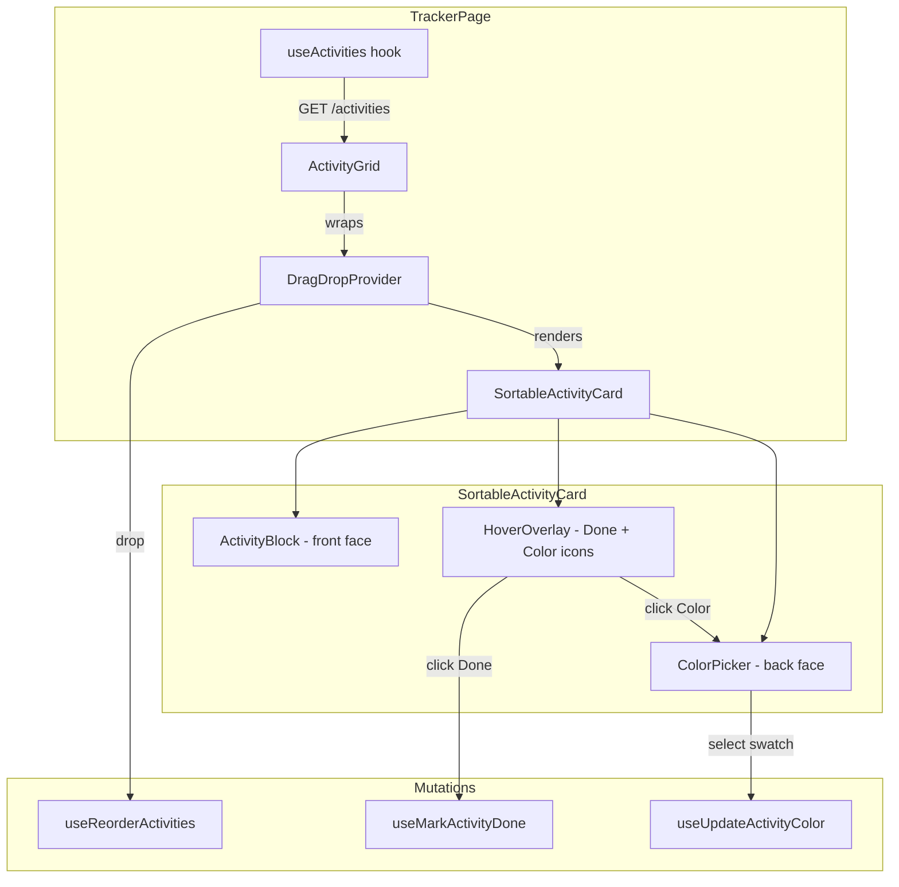
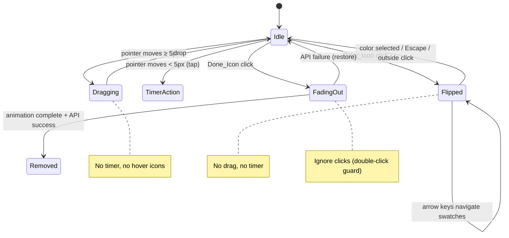

# Design Document: Activity Ordering, Completion & Color Override

## Overview

This design covers three interactive features on the activity tracker grid cards:

1. **Drag-and-drop reordering** — powered by `@dnd-kit/react` with `OptimisticSortingPlugin` for jank-free visual updates, sparse integer sort orders with midpoint insertion, and rollback on API failure.
2. **Mark as done** — single-click icon triggers a fade-out animation with optimistic removal, 409 timer-guard handling, and double-click protection.
3. **Card flip color override** — CSS 3D transform flip reveals the existing `ColorPicker` on the back face; selection triggers `PATCH /settings/activity-colors` and auto-flips back.

All features share a unified interaction model: a 5px distance constraint differentiates taps (timer) from drags, and event isolation prevents conflicting gestures (no timer during flip, no drag while flipped).

## Architecture



**Key architectural decisions:**

- **Single data source**: Replace `useTrackerData`'s per-project activity fetching with a flat `GET /activities` call that returns pre-sorted `EnrichedActivityItem[]`.
- **dnd-kit/react**: The v0.x `@dnd-kit/react` package with `OptimisticSortingPlugin` handles CSS Grid natively, avoids manual layout calculations, and provides optimistic DOM reordering without React re-renders during drag.
- **CSS 3D flip over JS animation libraries**: Zero dependencies, GPU-accelerated, simple boolean state toggle. The `perspective` + `transform-style: preserve-3d` + `rotateY(180deg)` approach is well-supported across browsers.
- **Sparse integers for sort order**: 1000-step gaps (1000, 2000, 3000…) with midpoint insertion. When adjacent values differ by < 2, a full rebalance fires a single PATCH.

## Components and Interfaces

### New/Modified Components

| Component | Location | Responsibility |
|-----------|----------|----------------|
| `useActivities` | `src/hooks/use-activities.ts` | TanStack Query hook for `GET /activities`, optional `includeDone` param |
| `useReorderActivities` | `src/hooks/use-reorder-activities.ts` | Mutation for `PATCH /activities/reorder`, optimistic cache update + rollback |
| `useMarkActivityDone` | `src/hooks/use-mark-activity-done.ts` | Mutation for `PATCH /activities/{id}/done`, 409 handling |
| `ActivityGrid` (modified) | `src/components/tracker/activity-grid.tsx` | Wrap children in `DragDropProvider`, manage done toggle, done section |
| `SortableActivityCard` | `src/components/tracker/sortable-activity-card.tsx` | dnd-kit `useSortable` wrapper, flip state, hover overlay, fade-out animation |
| `HoverOverlay` | `src/components/tracker/hover-overlay.tsx` | Two icon buttons (done + color) with visibility logic |
| `FlipCard` | `src/components/tracker/flip-card.tsx` | CSS 3D flip container with front/back face slots |

### Component Interfaces

```typescript
// useActivities hook
interface UseActivitiesOptions {
  includeDone?: boolean
}
interface UseActivitiesReturn {
  activities: EnrichedActivityItem[]
  doneCount: number
  isLoading: boolean
  isError: boolean
  refetch: () => void
}

// SortableActivityCard props
interface SortableActivityCardProps {
  activity: EnrichedActivityItem
  color: ResolvedColor
  elapsed: number
  isRunning: boolean
  isTimerLoading: boolean
  isDragActive: boolean // global drag state from DragDropProvider
  onTimerClick: (activityId: string) => void
  onMarkDone: (activityId: string) => void
  onColorSelect: (activityId: string, token: ColorToken) => void
}

// HoverOverlay props
interface HoverOverlayProps {
  onDoneClick: () => void
  onColorClick: () => void
  isDragActive: boolean
  isTimerRunning: boolean
  isDoneDisabled: boolean
}

// FlipCard props
interface FlipCardProps {
  isFlipped: boolean
  front: ReactNode
  back: ReactNode
  onFlipComplete?: () => void
}
```

### Interaction State Machine



## Data Models

### API Types (from openapi.json, generated)

```typescript
// GET /activities response
interface EnrichedActivitiesResponse {
  activities: EnrichedActivityItem[]
  meta: { doneCount: number }
}

interface EnrichedActivityItem {
  id: string
  name: string
  projectId: string
  projectName: string
  tagId: string
  tagName: string
  tagColor: string | null
  rateOverride: number | null
  runningEntry: object | null
  isDone: boolean
  sortOrder: number | null
  doneAt: string | null
}

// PATCH /activities/reorder
interface ReorderRequest {
  order: ReorderItem[] // max 200 items
}
interface ReorderItem {
  activityId: string // uuid
  sortOrder: number  // 0..999_999_999
}
interface ReorderResponse {
  updated: number
}

// PATCH /activities/{id}/done
interface ActivityDoneRequest {
  isDone: boolean
}
interface ActivityDoneResponse {
  activityId: string
  isDone: boolean
  doneAt: string | null
}
```

### Sort Order Computation (Pure Functions)

```typescript
const SORT_GAP = 1000
const MAX_SORT_ORDER = 999_999_999

/** Compute midpoint between two adjacent sort orders */
function computeMidpoint(before: number, after: number): number {
  return Math.floor((before + after) / 2)
}

/** Check if rebalance is needed (gap < 2 between adjacent) */
function needsRebalance(sortedOrders: number[]): boolean {
  for (let i = 0; i < sortedOrders.length - 1; i++) {
    if (sortedOrders[i + 1] - sortedOrders[i] < 2) return true
  }
  return false
}

/** Rebalance all items with fresh 1000-step gaps */
function rebalance(activityIds: string[]): ReorderItem[] {
  return activityIds.map((id, i) => ({
    activityId: id,
    sortOrder: (i + 1) * SORT_GAP,
  }))
}

/** Compute new sort orders after moving an item */
function computeReorderPayload(
  items: { id: string; sortOrder: number | null }[],
  movedId: string,
  newIndex: number
): ReorderItem[] {
  // ... returns only changed items, or full rebalance if gaps collapsed
}
```

## Correctness Properties

*A property is a characteristic or behavior that should hold true across all valid executions of a system — essentially, a formal statement about what the system should do. Properties serve as the bridge between human-readable specifications and machine-verifiable correctness guarantees.*

### Property 1: Midpoint insertion preserves order invariant

*For any* two adjacent sort order integers (a, b) where b - a >= 2, computing the midpoint produces a value strictly greater than a and strictly less than b, maintaining sorted order.

**Validates: Requirements 2.5**

### Property 2: Rebalance produces valid sparse sort orders

*For any* list of activity IDs (length 1 to 200), rebalancing produces sort orders that are strictly increasing, use 1000-step gaps, start at 1000, and all values remain within the range [0, 999_999_999].

**Validates: Requirements 2.5, 2.6**

### Property 3: Reorder payload contains only changed items

*For any* activity list with valid sort orders and any valid move operation (source index → target index), the computed reorder payload includes only items whose sort order changed compared to their previous value, and applying the payload to the original list yields the expected new visual order.

**Validates: Requirements 2.4**

### Property 4: Needs-rebalance detects collapsed gaps

*For any* list of sorted integers where at least one pair of adjacent values differs by less than 2, `needsRebalance` returns true; for any list where all adjacent pairs differ by 2 or more, it returns false.

**Validates: Requirements 2.6**

### Property 5: Distance constraint classifies tap vs drag

*For any* pointer movement distance (non-negative number), movement below 5 pixels classifies as a tap (timer action), and movement at or above 5 pixels classifies as a drag initiation. These classifications are mutually exclusive and exhaustive.

**Validates: Requirements 2.2, 6.1, 6.2**

### Property 6: Done-icon disabled state matches timer running state

*For any* activity, the done icon is disabled (visually at opacity 0.4 and click-inert) if and only if that activity has a non-null `runningEntry`.

**Validates: Requirements 4.8**

### Property 7: Active-only filtering excludes all done activities

*For any* list of `EnrichedActivityItem` objects with mixed `isDone` values, filtering for active-only display produces a list containing exactly those items where `isDone` equals `false`, preserving their relative order.

**Validates: Requirements 1.2**

## Error Handling

| Scenario | API Response | UI Behavior |
|----------|-------------|-------------|
| Reorder fails | Any non-2xx | Revert grid to pre-drag order, show error toast |
| Mark done — timer running | 409 `timer_running` | Cancel fade-out, restore card, toast "Stop the timer first" |
| Mark done — activity not found | 404 | Remove card from DOM immediately (stale) |
| Mark done — other failure | 4xx/5xx | Cancel fade-out, restore card, show error toast |
| Color override fails | Any non-2xx | Show error toast, revert card to previous color |
| Activity list fetch fails | Any non-2xx | Show error state with retry button |
| Reactivate done activity fails | Any non-2xx | Show error toast, keep card in done section |

**Optimistic update pattern**: All mutations use TanStack Query's `onMutate` → optimistic cache update, `onError` → rollback to previous snapshot, `onSettled` → invalidate to sync with server.

## Testing Strategy

### Property-Based Tests (fast-check, 100+ iterations each)

| Property | Module Under Test | Generator |
|----------|-------------------|-----------|
| P1: Midpoint preserves order | `sort-order-utils.ts` | Arbitrary sorted integer pairs within [0, 999_999_999] where gap >= 2 |
| P2: Rebalance valid output | `sort-order-utils.ts` | Arbitrary string arrays (1–200 length) |
| P3: Payload contains only changes | `sort-order-utils.ts` | Arbitrary activity lists + valid move index pairs |
| P4: Needs-rebalance detection | `sort-order-utils.ts` | Arbitrary sorted integer arrays (some with gaps < 2, some without) |
| P5: Distance tap vs drag | `distance-constraint` | Arbitrary numbers [0, 100] |
| P6: Done disabled matches timer | `hover-overlay` | Arbitrary activity objects with/without runningEntry |
| P7: Active-only filtering | `activity-filters.ts` | Arbitrary EnrichedActivityItem arrays with random isDone flags |

**Library**: `fast-check` (already in devDependencies)

**Configuration**: Each property test runs minimum 100 iterations with `fc.assert(fc.property(...), { numRuns: 100 })`.

**Tagging**: Each test tagged with `// Feature: activity-ordering-completion-colors, Property N: <text>`

### Unit Tests (Vitest + React Testing Library)

- `useActivities` — mock API responses, verify query key, `includeDone` param
- `useReorderActivities` — verify optimistic update + rollback on error
- `useMarkActivityDone` — verify 409 handling returns specific error, 404 treated as success
- `HoverOverlay` — visible on hover (fine pointer), always visible (coarse pointer), hidden during drag
- `FlipCard` — CSS classes toggled correctly, `onFlipComplete` fires after transition
- `SortableActivityCard` — event isolation: no timer on icon click, no drag when flipped
- Done toggle section — renders when `doneCount > 0`, refetches with `includeDone=true`

### Integration Tests

- Full drag-and-drop flow with mocked API (drop → PATCH fires → grid stable)
- Mark done → fade-out → removal flow
- Card flip → color select → auto-flip-back → color applied

### Edge Cases (covered by property generators)

- Empty activity list
- Single activity (no reorder possible)
- Maximum 200 activities in reorder payload
- Sort orders at boundary (0 and 999_999_999)
- Adjacent sort orders with gap of exactly 1 (triggers rebalance)
- Whitespace-only activity names (render edge case, not validation)
