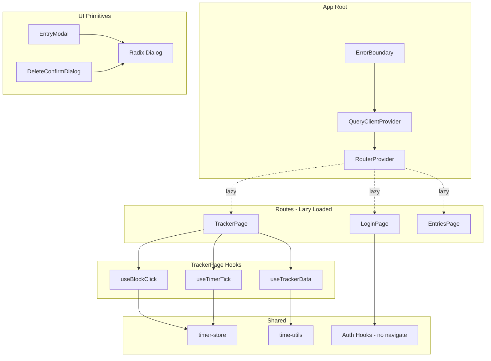

# Design Document

## Overview

This design addresses nine code quality improvements across the My Time Web application. The refactoring targets SRP violations in TrackerPage, testability issues in auth hooks, accessibility gaps in dialogs, and code hygiene problems — all without changing user-visible behavior.

The work decomposes into three tiers:
1. **Pre-cleanup** (Reqs 7, 8, 9): Remove side effects, console.log, and duplicated formatting — prerequisites for safe extraction.
2. **Extraction & restructuring** (Reqs 1, 3, 5): Pull logic into focused hooks, decouple navigation, add lazy loading.
3. **Cross-cutting improvements** (Reqs 2, 4, 6): Error boundary, Zod standardization, accessible dialogs.

## Architecture



## Components and Interfaces

### Error Boundary (`src/components/error-boundary.tsx`)

```typescript
interface ErrorBoundaryProps {
  children: React.ReactNode
}

interface ErrorBoundaryState {
  hasError: boolean
}

// Class component (required for componentDidCatch)
class ErrorBoundary extends React.Component<ErrorBoundaryProps, ErrorBoundaryState> {
  state = { hasError: false }

  static getDerivedStateFromError(): ErrorBoundaryState {
    return { hasError: true }
  }

  handleRetry = () => {
    this.setState({ hasError: false })
  }

  render(): React.ReactNode
}
```

The fallback renders a centered card with heading, description, and a native `<button>` element (inherently keyboard-accessible). The retry simply resets `hasError` to `false`, allowing React to re-attempt rendering children. If children throw again, `getDerivedStateFromError` fires again — no infinite loop because setState in getDerivedStateFromError is synchronous and doesn't trigger a re-render loop.

### useTrackerData Hook (`src/hooks/use-tracker-data.ts`)

```typescript
interface TrackerData {
  isLoading: boolean
  isError: boolean
  allActivities: Array<{
    id: string
    name: string
    tagId: string
    projectId: string
    projectName: string
  }>
  tagMap: Map<string, string>
  activityElapsedMap: Map<string, number>
  currentTimer: CurrentTimerResponse | undefined
  refetchProjects: () => void
}

function useTrackerData(): TrackerData
```

Consolidates: `useProjects`, `useTags`, `useCurrentTimer`, `useEntries`, `useQueries` (activities per project), and the derived `allActivities`, `tagMap`, `activityElapsedMap` memos. The elapsed map computation is a pure function with no side effects — no ref writes, no console calls.

### useTimerTick Hook (`src/hooks/use-timer-tick.ts`)

```typescript
interface TimerTickControls {
  startTicking: () => void
  stopTicking: () => void
}

function useTimerTick(currentTimer: CurrentTimerResponse | undefined): TimerTickControls
```

Encapsulates: interval ref, `startTicking`/`stopTicking` callbacks, unmount cleanup effect, and rehydration effect that starts ticking when `currentTimer` indicates an active timer (no `endTime`).

### useBlockClick Hook (`src/hooks/use-block-click.ts`)

```typescript
interface BlockClickResult {
  handleBlockClick: (activityId: string) => void
  loadingActivityId: string | null
}

function useBlockClick(controls: TimerTickControls): BlockClickResult
```

Encapsulates: `useStartTimer`, `useStopTimer`, `useQueryClient`, `loadingActivityId` state, and the click handler logic that reads store state via `getState()`, calls mutations, updates store, and invalidates queries.

### Auth Hooks Refactored (`src/hooks/use-auth.ts`)

```typescript
// Before: hooks call useNavigate() internally
// After: hooks return mutation objects only

function useLogin(): UseMutationResult<LoginResponse, Error, LoginData>
function useRegister(): UseMutationResult<void, Error, RegisterData>
function useConfirm(): UseMutationResult<void, Error, ConfirmData>
function useForgotPassword(): UseMutationResult<void, Error, ForgotData>
function useResetPassword(): UseMutationResult<void, Error, ResetData>
```

Navigation moves to page components via `mutate(data, { onSuccess: () => navigate(...) })`.

### lazyWithRetry Utility (`src/lib/lazy-with-retry.ts`)

```typescript
function lazyWithRetry<T extends React.ComponentType<unknown>>(
  factory: () => Promise<{ default: T }>
): React.LazyExoticComponent<T>
```

Wraps `React.lazy` with retry logic: on import failure, retries up to 2 times with a brief delay. After exhausting retries, throws an error caught by the ErrorBoundary.

### Dialog Component (`src/components/ui/dialog.tsx`)

Standard shadcn/ui Dialog built on `@radix-ui/react-dialog`. Exports: `Dialog`, `DialogTrigger`, `DialogContent`, `DialogHeader`, `DialogTitle`, `DialogDescription`, `DialogFooter`, `DialogClose`. Radix provides role="dialog", aria-modal, focus trapping, Escape dismissal, and scroll lock out of the box.

### Suspense Fallback (`src/components/ui/loading-spinner.tsx`)

```typescript
function LoadingSpinner(): JSX.Element
```

Centered spinner with `aria-label="Loading page"`. Used as Suspense fallback for lazy routes.

## Data Models

No new data models are introduced. The refactoring reorganizes existing data flows:

| Data | Source | Consumer |
|------|--------|----------|
| Projects, Tags, Entries | TanStack Query via API | `useTrackerData` |
| Timer state (isRunning, elapsed) | Zustand store | `useTimerTick`, `useBlockClick`, TrackerPage selectors |
| activityElapsedMap | Derived in `useTrackerData` | TrackerPage JSX |
| Auth tokens | `setTokens()` in `src/lib/auth.ts` | `useLogin` (on success) |

### activityElapsedMap Computation (Pure Function)

```typescript
// Extracted as a pure function for testability
function computeElapsedMap(entries: EntryResponse[]): Map<string, number> {
  const map = new Map<string, number>()
  for (const entry of entries) {
    if (entry.startTime && entry.endTime) {
      const duration = Date.parse(entry.endTime) - Date.parse(entry.startTime)
      map.set(entry.activityId, (map.get(entry.activityId) ?? 0) + duration)
    }
  }
  return map
}
```

This function is deterministic: same input always produces same output, no refs, no console, no external state. Can be called N times with same input and always returns an equivalent Map.

### allActivities Flattening (Pure Function)

```typescript
function flattenActivities(
  projects: Project[],
  activityResults: Array<Activity[] | undefined>
): FlatActivity[] {
  const result: FlatActivity[] = []
  for (let i = 0; i < projects.length; i++) {
    const activities = activityResults[i]
    if (activities) {
      for (const activity of activities) {
        result.push({
          id: activity.id,
          name: activity.name,
          tagId: activity.tagId,
          projectId: activity.projectId,
          projectName: projects[i].name,
        })
      }
    }
  }
  return result
}
```

## Correctness Properties

*A property is a characteristic or behavior that should hold true across all valid executions of a system — essentially, a formal statement about what the system should do. Properties serve as the bridge between human-readable specifications and machine-verifiable correctness guarantees.*

### Property 1: Elapsed map accumulation is correct and idempotent

*For any* list of time entries (each with activityId, startTime, endTime), the `computeElapsedMap` function SHALL produce a Map where each activityId maps to the exact sum of `(endTime - startTime)` for all entries with that activityId that have both fields defined, AND calling the function twice with the same input SHALL produce Maps with identical entries.

**Validates: Requirements 7.1, 7.2**

### Property 2: Activity flattening preserves all activities with correct project names

*For any* list of non-archived projects and corresponding activity arrays, the `flattenActivities` function SHALL produce a flat array containing exactly one element per activity across all projects, where each element's `projectName` equals the name of the project that contains it, and the total length equals the sum of all activity array lengths.

**Validates: Requirements 1.1**

### Property 3: Time formatting correctness

*For any* non-negative integer milliseconds value, `formatElapsed(ms)` SHALL produce a string `"HH:MM:SS"` where parsing back yields `hours * 3600 + minutes * 60 + seconds === Math.floor(ms / 1000)`, each segment is zero-padded to 2 digits, and minutes and seconds are each in range [0, 59].

**Validates: Requirements 9.4**

## Error Handling

| Scenario | Handler | User Experience |
|----------|---------|----------------|
| Render error in any routed component | ErrorBoundary | Fallback UI with "Try again" button |
| Lazy chunk load failure (network) | `lazyWithRetry` (2 retries) → ErrorBoundary | Auto-retry transparent; after 3 failures, fallback with "Reload page" |
| API errors in TrackerPage | useTrackerData returns `isError: true` | "Failed to load" with Retry button (existing behavior) |
| Timer start/stop mutation failure | useBlockClick `onSettled` clears loading state | Loading indicator stops; mutation error available to caller |
| Auth mutation failure | TanStack Query error state | Page component renders error message (existing behavior) |

**Design decision**: The ErrorBoundary does NOT log errors to an external service in this iteration. It uses `getDerivedStateFromError` only (not `componentDidCatch` for side effects). Error reporting can be added later without changing the boundary's contract.

## Testing Strategy

### Property-Based Tests (Vitest + fast-check)

- Library: **fast-check** (well-maintained, TypeScript-native, integrates with Vitest)
- Minimum 100 iterations per property test
- Each test tagged with: `// Feature: code-quality-refactor, Property N: <title>`

| Property | Test File | What's Generated |
|----------|-----------|------------------|
| 1: Elapsed map accumulation | `src/lib/__tests__/compute-elapsed-map.test.ts` | Random arrays of entries with UUIDs, ISO timestamps |
| 2: Activity flattening | `src/hooks/__tests__/flatten-activities.test.ts` | Random project arrays with nested activity arrays |
| 3: Time formatting | `src/lib/__tests__/time-utils.test.ts` | Random non-negative integers (0 to 86400000+) |

### Unit Tests (Vitest + React Testing Library)

| Component/Hook | Key Tests |
|----------------|-----------|
| ErrorBoundary | Catches error → shows fallback; retry resets; re-throw shows fallback again; button keyboard accessible |
| useTrackerData | Returns correct loading/error states; computes allActivities and tagMap correctly (mocked API) |
| useTimerTick | Starts interval on active timer; clears on stop; clears on unmount (fake timers) |
| useBlockClick | Stop running activity; start new activity; handles 409 retry |
| Auth hooks | No navigation on success; setTokens called for login; returns mutation result |
| Page components | Login navigates "/" on success; Register navigates "/confirm"; etc. |
| lazyWithRetry | Succeeds after 1 failure; fails after 3 failures |
| Dialog (EntryModal) | role="dialog", aria-modal, aria-labelledby, Escape closes, focus trap |
| Dialog (DeleteConfirm) | Same accessibility assertions |

### Smoke Tests

| Check | Method |
|-------|--------|
| Zero bare `zod` imports | grep/lint rule |
| Zero `console.log` in tracker.tsx | grep or eslint no-console |
| No local `fmt()` in tracker.tsx | grep |
| Routes use React.lazy | Code review / test that verifies dynamic import |
| @radix-ui/react-dialog in package.json | Dependency check |

### Integration / Regression

- `npm run build` succeeds with no warnings
- Existing Playwright auth flow passes unchanged
- Manual before/after visual comparison of TrackerPage states (loading, error, empty, idle, running)
