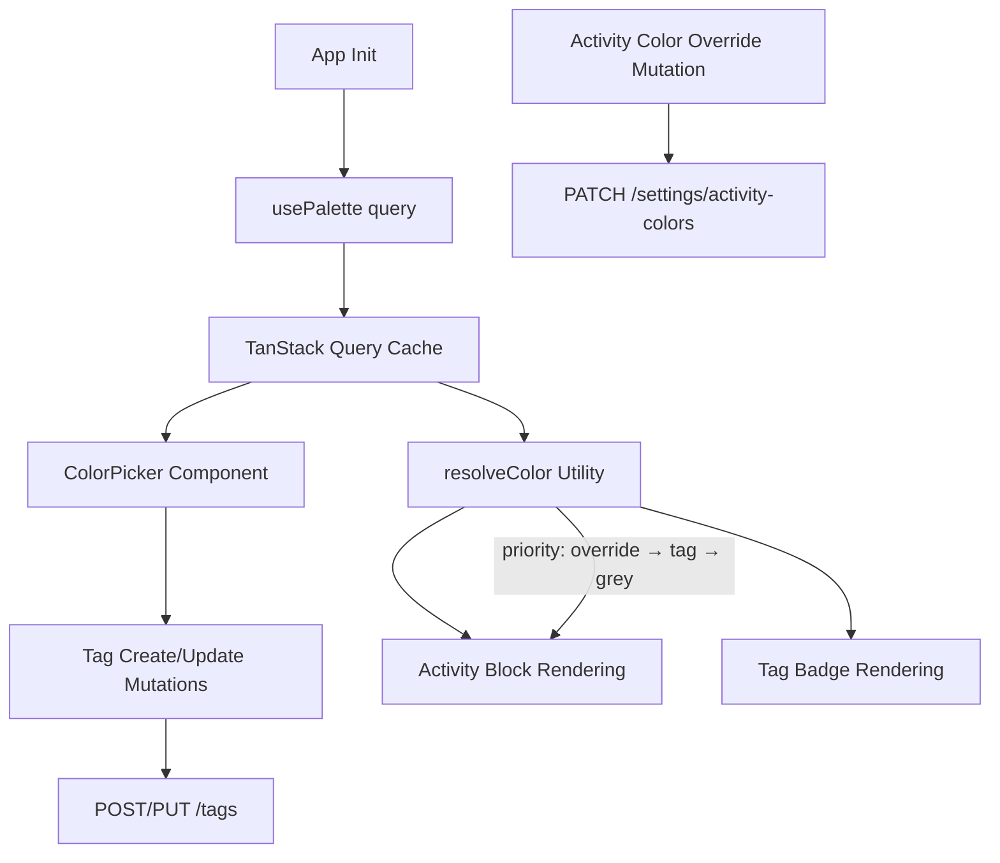

# Design Document: Color Token System

## Overview

This feature migrates the frontend from raw hex color values to a token-based color system. The API now stores color token names (e.g., `"blue"`, `"teal"`) on tags and activity overrides. A new unauthenticated `GET /palette` endpoint provides the token-to-hex mapping.

The implementation adds:
1. A palette query that fetches and caches the color mapping on app init
2. A `resolveColor` utility that maps tokens to hex values with correct priority
3. A `ColorPicker` component showing 7 selectable swatches
4. Updated tag and activity mutations to send token names

All color resolution flows through the cached palette — no hardcoded hex values for token colors.

## Architecture



Data flow:
- **Write path**: ColorPicker emits token name → mutation sends to API
- **Read path**: Component calls `resolveColor(override, tagColor)` → looks up hex in cached palette

## Components and Interfaces

### 1. `usePalette` Hook (`src/hooks/use-palette.ts`)

TanStack Query hook for fetching and caching the palette. Unauthenticated — no token attached.

```typescript
import { useQuery } from "@tanstack/react-query"
import { client } from "@/api/client"

// Palette type derived from API response
export type ColorShades = { dark: string; normal: string; light: string }
export type GreyShades = {
  darkest: string; dark: string; normal: string
  light: string; lighter: string; lightest: string
}
export type Palette = Record<string, ColorShades> & { grey: GreyShades }

export function usePalette() {
  return useQuery({
    queryKey: ["palette"],
    queryFn: async () => {
      const { data, error } = await client.GET("/palette")
      if (error) throw error
      return data as Palette
    },
    staleTime: Infinity,     // never refetch — palette is static
    gcTime: Infinity,        // never garbage-collect
    retry: 1,                // one retry per requirement 1.4
    retryDelay: 2000,        // 2-second delay per requirement 1.4
  })
}
```

Configuration rationale:
- `staleTime: Infinity` — palette never changes within a session
- `retry: 1` + `retryDelay: 2000` — matches requirement for single retry after 2s
- No auth middleware needed — the endpoint is unauthenticated

### 2. `resolveColor` Utility (`src/lib/color-utils.ts`)

Pure function that resolves a token to hex values given priority order.

```typescript
import type { Palette, ColorShades } from "@/hooks/use-palette"

export type ColorToken = "blue" | "green" | "red" | "yellow" | "orange" | "teal" | "purple"

export const SELECTABLE_COLORS: ColorToken[] = [
  "blue", "green", "red", "yellow", "orange", "teal", "purple"
]

const GREY_FALLBACK_HEX = "#B2B2B2"

export interface ResolvedColor {
  dark: string
  normal: string
  light: string
}

/**
 * Resolves the display color for an activity or tag.
 * Priority: override → tag color → grey.
 * Returns hex shades from the palette.
 */
export function resolveColor(
  palette: Palette | undefined,
  override: string | null | undefined,
  tagColor: string | null | undefined
): ResolvedColor {
  if (!palette) {
    return { dark: GREY_FALLBACK_HEX, normal: GREY_FALLBACK_HEX, light: GREY_FALLBACK_HEX }
  }

  const token = override ?? tagColor ?? "grey"
  const shades = palette[token]

  if (!shades) {
    const grey = palette.grey
    return { dark: grey.dark, normal: grey.normal, light: grey.light }
  }

  return { dark: shades.dark, normal: shades.normal, light: shades.light }
}

/**
 * Resolves a single tag color to hex shades.
 */
export function resolveTagColor(
  palette: Palette | undefined,
  tagColor: string | null | undefined
): ResolvedColor {
  return resolveColor(palette, undefined, tagColor)
}
```

### 3. `ColorPicker` Component (`src/components/tags/color-picker.tsx`)

Controlled component displaying 7 swatches.

```typescript
interface ColorPickerProps {
  value: ColorToken | null
  onChange: (token: ColorToken) => void
  disabled?: boolean
}
```

Behavior:
- Renders 7 circular swatches using `palette[token].normal` as fill
- Selected swatch shows a checkmark icon (accessible without color alone)
- Disabled when palette is loading (`usePalette().isLoading`)
- Does not include grey as an option
- Emits lowercase token string on selection

### 4. Tag Mutations (update existing `src/hooks/use-tags.ts`)

Add `useCreateTag` and `useUpdateTag` mutations that include the `color` field as a token name string. On `400` with `type: "invalid_color"`, surface the error to the form.

### 5. Activity Color Override Mutation (`src/hooks/use-activity-colors.ts`)

```typescript
export function useUpdateActivityColor() {
  const queryClient = useQueryClient()
  return useMutation({
    mutationFn: async ({ activityId, color }: { activityId: string; color: ColorToken }) => {
      const { data, error } = await client.PATCH("/settings/activity-colors", {
        body: { colors: { [activityId]: color } },
      })
      if (error) throw error
      return data
    },
    onSuccess: () => {
      queryClient.invalidateQueries({ queryKey: ["settings"] })
    },
  })
}
```

## Data Models

### Palette Response (from `GET /palette`)

```typescript
// 7 selectable colors — each has 3 shades
type ColorShades = { dark: string; normal: string; light: string }

// Grey has 6 shades (used for UI chrome)
type GreyShades = {
  darkest: string; dark: string; normal: string
  light: string; lighter: string; lightest: string
}

type Palette = {
  blue: ColorShades
  green: ColorShades
  red: ColorShades
  yellow: ColorShades
  orange: ColorShades
  teal: ColorShades
  purple: ColorShades
  grey: GreyShades
}
```

### ColorToken Enum

```typescript
type ColorToken = "blue" | "green" | "red" | "yellow" | "orange" | "teal" | "purple"
```

Matches the API's `ColorToken` enum. Grey is excluded from user-selectable tokens.

### Tag Model (relevant fields)

```typescript
interface Tag {
  id: string
  name: string
  color: ColorToken | null  // null → grey default
  // ...other fields
}
```

### Activity Color Override

```typescript
// Stored in user settings
type ActivityColors = Record<string, ColorToken>  // activityId → token
```

### Resolution Priority

```
Activity display color = override ?? tag.color ?? "grey"
```

Then look up hex from `palette[resolvedToken]`.


## Correctness Properties

*A property is a characteristic or behavior that should hold true across all valid executions of a system — essentially, a formal statement about what the system should do. Properties serve as the bridge between human-readable specifications and machine-verifiable correctness guarantees.*

### Property 1: Swatch fill colors match palette

*For any* palette mapping and *for each* of the 7 selectable color tokens, the ColorPicker swatch for that token SHALL have its background color set to `palette[token].normal`.

**Validates: Requirements 2.2**

### Property 2: Exactly one selection indicator

*For any* ColorPicker state where a token is selected, exactly one swatch SHALL display the selected indicator (checkmark/border), and it SHALL be the swatch corresponding to the selected token.

**Validates: Requirements 2.3**

### Property 3: ColorPicker value round-trip

*For any* ColorToken value passed as the `value` prop, the ColorPicker SHALL show that token's swatch as selected. *For any* token the user selects, the `onChange` callback SHALL receive that exact lowercase token string.

**Validates: Requirements 2.6, 2.7**

### Property 4: Tag mutations send token names only

*For any* ColorToken selected in the tag form, the resulting `POST /tags` or `PUT /tags/{id}` request body SHALL contain `color` equal to that token as a plain lowercase string from the set {blue, green, red, yellow, orange, teal, purple}, and SHALL NOT contain a hex value (matching `/#[0-9a-fA-F]{3,8}/`).

**Validates: Requirements 3.1, 3.2, 3.3**

### Property 5: Activity override request structure

*For any* activityId and *for any* ColorToken, the `PATCH /settings/activity-colors` request body SHALL be `{ "colors": { "<activityId>": "<token>" } }` where the token value is a plain lowercase string from the allowed set.

**Validates: Requirements 4.1, 4.2**

### Property 6: Color resolution priority and shade correctness

*For any* palette, *for any* override (ColorToken | null), and *for any* tagColor (ColorToken | null):
- The resolved token SHALL be the first non-null value in order: override, tagColor, "grey"
- `resolved.dark` SHALL equal `palette[resolvedToken].dark`
- `resolved.normal` SHALL equal `palette[resolvedToken].normal`
- `resolved.light` SHALL equal `palette[resolvedToken].light`

**Validates: Requirements 5.1, 5.2, 5.3, 6.1, 6.2, 6.3**

### Property 7: Palette unavailable fallback

*For any* combination of override and tagColor values, when the palette is undefined/unavailable, `resolveColor` SHALL return `#B2B2B2` for all three shades (dark, normal, light).

**Validates: Requirements 6.5**

## Error Handling

| Scenario | Behavior |
|----------|----------|
| `GET /palette` network error | Retry once after 2s. On second failure, show full-screen error with retry button. |
| `GET /palette` non-200 response | Same as network error — TanStack Query treats non-200 as error. |
| `GET /palette` timeout (>10s) | AbortController signal on the fetch; treated as network error. |
| Tag create/update returns 400 `invalid_color` | Show inline validation error near color picker. Preserve form state. |
| Activity override returns 400 `invalid_color` | Show toast/inline error. Do not update local color state. |
| Palette unavailable during render | `resolveColor` returns hardcoded `#B2B2B2`. ColorPicker disables interaction. |
| Unknown token in tag.color (e.g., from future API change) | `resolveColor` falls through to grey shades gracefully — `palette[unknownToken]` is undefined, so fallback to grey. |

## Testing Strategy

### Unit Tests (Vitest + React Testing Library)

- `resolveColor` — specific examples: null override + null tag → grey, valid override takes priority, unknown token → grey
- `resolveTagColor` — null → grey, valid token → correct hex
- `SELECTABLE_COLORS` does not contain "grey"
- `ColorPicker` renders 7 swatches, disables when palette loading
- Tag form submission blocked without color selection
- Error state renders on double palette failure
- 400 `invalid_color` error surfaces inline message

### Property-Based Tests (fast-check)

Library: **fast-check** (already in devDependencies)

Configuration: minimum 100 iterations per property.

Each property test tagged with comment format:
`// Feature: color-token-system, Property N: <title>`

Properties to implement:
1. Swatch fill colors match palette
2. Exactly one selection indicator
3. ColorPicker value round-trip
4. Tag mutations send token names only
5. Activity override request structure
6. Color resolution priority and shade correctness
7. Palette unavailable fallback

Property 6 (resolution) and Property 7 (fallback) are pure-function tests — ideal PBT candidates with zero UI dependency. Properties 1–5 involve component rendering but can still use generated inputs (random palettes, random token selections).

### Integration Tests

- Full tag create flow: open form → pick color → submit → verify request body
- Activity color override: select override → verify PATCH body → verify UI update
- Palette fetch on app init: mount app → verify unauthenticated GET /palette fires
