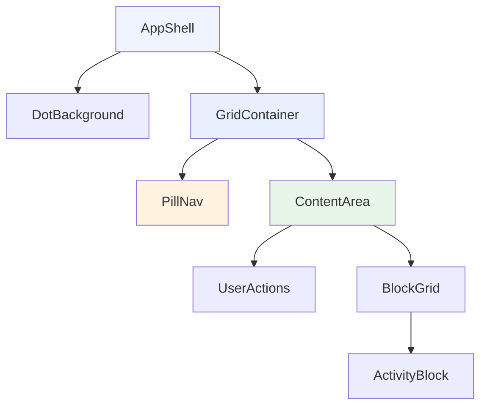

# Design Document

## Overview

Replace the current flex-based sidebar/topbar layout with a responsive 12-column grid system. The new layout uses fixed-width containers that snap at five breakpoints, a floating pill navigation (vertical on desktop, horizontal on mobile/tablet), a responsive activity block grid, and a dotted background pattern. All layout tokens live in Tailwind CSS 4's `@theme` block.

### Current State

- `app-shell.tsx`: flex row with fixed-width sidebar + flex-1 content column
- `sidebar.tsx`: 240px vertical nav, hidden below `md` (768px)
- `topbar.tsx`: horizontal bar with logo (mobile) + user actions (logout/email)
- `activity-grid.tsx`: simple responsive grid using default Tailwind breakpoints (`sm:grid-cols-2 lg:grid-cols-3 xl:grid-cols-4`)

### Target State

- Single `AppShell` component managing a centered grid container with dot-pattern background
- `PillNav` component: fixed vertical card on ≥1440px, sticky horizontal bar on <1440px
- `ContentArea` spanning columns 4–12 on desktop, full-width otherwise
- `BlockGrid` nested inside content area with breakpoint-specific column counts and aspect ratios
- `UserActions` placed top-right of content area (desktop) or inside sticky bar (mobile/tablet)
- All sizing tokens defined in `@theme`

## Architecture



### Layout Topology

```
┌─────────────────────────────────────────────────────────────────┐
│  Dot-pattern background (full viewport)                         │
│  ┌───────────────────────────────────────────────────────────┐  │
│  │  GridContainer (centered, fixed-width, 12 columns)        │  │
│  │  ┌──────────┐  ┌──────────────────────────────────────┐  │  │
│  │  │ Cols 1–3 │  │ ContentArea (Cols 4–12)              │  │  │
│  │  │          │  │  ┌────────────────────────────────┐  │  │  │
│  │  │ PillNav  │  │  │ UserActions (top-right)        │  │  │  │
│  │  │ (fixed)  │  │  ├────────────────────────────────┤  │  │  │
│  │  │          │  │  │ BlockGrid                      │  │  │  │
│  │  │          │  │  │  ┌─────┐ ┌─────┐ ┌─────┐     │  │  │  │
│  │  │          │  │  │  │Block│ │Block│ │Block│     │  │  │  │
│  │  │          │  │  │  └─────┘ └─────┘ └─────┘     │  │  │  │
│  │  │          │  │  └────────────────────────────────┘  │  │  │
│  │  └──────────┘  └──────────────────────────────────────┘  │  │
│  └───────────────────────────────────────────────────────────┘  │
└─────────────────────────────────────────────────────────────────┘
```

**Mobile/Tablet (< 1440px):**

```
┌─────────────────────────────────────┐
│ PillNav (sticky horizontal bar 56px)│
│ ┌─ icons ──────────┐ ┌─UserActs─┐  │
│ └──────────────────-┘ └──────────┘  │
├─────────────────────────────────────┤
│ GridContainer (centered, 12 cols)   │
│ ┌─────────────────────────────────┐ │
│ │ ContentArea (all 12 columns)    │ │
│ │  BlockGrid                      │ │
│ │  ┌──────────────────────────┐   │ │
│ │  │ Block (2:1 on mobile)    │   │ │
│ │  └──────────────────────────┘   │ │
│ └─────────────────────────────────┘ │
└─────────────────────────────────────┘
```

## Components and Interfaces

### Theme Tokens (index.css @theme additions)

```css
@theme {
  /* Container widths */
  --container-xs: 360px;
  --container-sm: 720px;
  --container-md: 960px;
  --container-lg: 1200px;
  --container-xl: 1440px;

  /* Gutter sizes */
  --spacing-gutter-xs: 12px;
  --spacing-gutter-sm: 16px;
  --spacing-gutter-md: 20px;
  --spacing-gutter-lg: 24px;

  /* Custom breakpoints (additive — default sm/md/lg/xl/2xl retained) */
  --breakpoint-tablet: 768px;
  --breakpoint-desktop: 1024px;
  --breakpoint-wide: 1440px;
  --breakpoint-ultrawide: 1920px;
}
```

### Component: AppShell

**File:** `src/components/layout/app-shell.tsx`

```typescript
export default function AppShell(): JSX.Element
```

Responsibilities:
- Renders dot-pattern background on body-level wrapper
- Contains `GridContainer` with nested `PillNav`, `ContentArea`
- Uses `<Outlet />` from React Router inside `ContentArea`

### Component: GridContainer

**File:** `src/components/layout/grid-container.tsx`

```typescript
export interface GridContainerProps {
  children: ReactNode
}

export function GridContainer({ children }: GridContainerProps): JSX.Element
```

Responsibilities:
- Horizontally centered `div` with `display: grid` and 12 equal columns
- Snaps width at each breakpoint using Tailwind responsive utilities referencing theme tokens
- Applies breakpoint-specific gutter via `gap` property
- No CSS transitions on width changes

Implementation approach — use a single `div` with responsive classes:
```
w-[var(--container-xs)]     (default, 360px+ viewport)
tablet:w-[var(--container-sm)]
desktop:w-[var(--container-md)]
wide:w-[var(--container-lg)]
ultrawide:w-[var(--container-xl)]
```

Wait — Requirement 8.4 says NO arbitrary value syntax for defined tokens. Since Tailwind CSS 4 doesn't generate utility classes for custom `--container-*` properties automatically, we need to define them as spacing/width values the utility system recognizes. The cleanest approach: use explicit width classes via `@utility` or inline `w-` with the token referenced through Tailwind's generated utilities.

**Resolution:** Define the container widths under `--width-container-*` namespace so Tailwind 4 generates `w-container-xs`, `w-container-sm`, etc. Similarly, gutters under `--spacing-gutter-*` generate `gap-gutter-xs`, etc.

Updated theme tokens:

```css
@theme {
  /* Container widths — generates w-container-* utilities */
  --width-container-xs: 360px;
  --width-container-sm: 720px;
  --width-container-md: 960px;
  --width-container-lg: 1200px;
  --width-container-xl: 1440px;

  /* Gutter sizes — generates gap-gutter-* utilities */
  --spacing-gutter-xs: 12px;
  --spacing-gutter-sm: 16px;
  --spacing-gutter-md: 20px;
  --spacing-gutter-lg: 24px;

  /* Custom breakpoints — generates tablet:, desktop:, wide:, ultrawide: variants */
  --breakpoint-tablet: 768px;
  --breakpoint-desktop: 1024px;
  --breakpoint-wide: 1440px;
  --breakpoint-ultrawide: 1920px;
}
```

Grid container className composition:
```
mx-auto grid grid-cols-12
w-full max-w-container-xs gap-gutter-xs
tablet:w-container-sm tablet:gap-gutter-sm
desktop:w-container-md desktop:gap-gutter-md
wide:w-container-lg wide:gap-gutter-lg
ultrawide:w-container-xl ultrawide:gap-gutter-lg
```

Note: below 360px, `w-full` takes precedence (viewport < 360px = no breakpoint hit, `w-full` is the base). At 360px+, we want 360px fixed. Since there's no breakpoint for 360px, we handle this with a `min-[360px]:w-container-xs` — but that's arbitrary value syntax. Alternative: add a `--breakpoint-mobile: 360px` to generate a `mobile:` variant.

**Final breakpoint set:**
```css
--breakpoint-mobile: 360px;
--breakpoint-tablet: 768px;
--breakpoint-desktop: 1024px;
--breakpoint-wide: 1440px;
--breakpoint-ultrawide: 1920px;
```

Grid container classes:
```
mx-auto grid grid-cols-12
w-full gap-gutter-xs
mobile:w-container-xs
tablet:w-container-sm tablet:gap-gutter-sm
desktop:w-container-md desktop:gap-gutter-md
wide:w-container-lg wide:gap-gutter-lg
ultrawide:w-container-xl
```

### Component: PillNav

**File:** `src/components/layout/pill-nav.tsx`

```typescript
interface NavItem {
  label: string
  icon: LucideIcon
  to: string
  disabled?: boolean
}

export interface PillNavProps {
  items: NavItem[]
}

export function PillNav({ items }: PillNavProps): JSX.Element
```

Responsibilities:
- Renders navigation items using `NavLink` from React Router
- Desktop (≥1440px): vertical card, `fixed` position, vertically centered, within left 3 columns of grid — icon + text label
- Mobile/Tablet (<1440px): horizontal bar, `sticky top-0`, 56px height, icon-only, 44×44px tap targets
- White background, rounded corners (`rounded-2xl`), subtle shadow
- Active item: highlighted background + prominent text color
- Disabled items: 60% opacity, `pointer-events-none`

**Navigation items** (ordered):
1. Timer — `/` — `Timer` icon
2. Entries — `/entries` — `ListChecks` icon
3. Projects — `/projects` — `FolderKanban` icon (disabled)
4. Team — `/team` — `Users` icon (disabled)
5. Reports — `/reports` — `BarChart3` icon (disabled)

### Component: UserActions

**File:** `src/components/layout/user-actions.tsx`

```typescript
export interface UserActionsProps {
  className?: string
}

export function UserActions({ className }: UserActionsProps): JSX.Element
```

Responsibilities:
- Displays logout button (always)
- Displays user email (≥768px only, hidden on mobile)
- Desktop (≥1440px): rendered in top-right of ContentArea
- Mobile/Tablet: rendered inside sticky PillNav bar, right-aligned

### Component: BlockGrid

**File:** `src/components/tracker/activity-grid.tsx` (rework existing)

```typescript
export interface ActivityGridProps {
  children: ReactNode
}

export function ActivityGrid({ children }: ActivityGridProps): JSX.Element
```

Updated responsive grid classes:
```
grid grid-cols-1 gap-gutter-xs
tablet:grid-cols-2 tablet:gap-gutter-sm
desktop:grid-cols-3 desktop:gap-gutter-md
wide:grid-cols-3 wide:gap-gutter-lg
ultrawide:grid-cols-4 ultrawide:gap-gutter-lg
```

### Component: ActivityBlock (aspect ratio update)

**File:** `src/components/tracker/activity-block.tsx` (modify existing)

Changes:
- Desktop/Tablet (≥768px): keep `padding-bottom: 100%` for 1:1 square
- Mobile (<768px): change to `padding-bottom: 50%` for 2:1 ratio
- Mobile: reduce padding from `p-6` to `p-4`
- Mobile: adjust font sizes per Requirement 7

Responsive text sizing:
| Element | ≥768px | <768px |
|---------|--------|--------|
| Tag badge | text-xs (12px) | text-xs (12px) |
| Project name | text-sm (14px) | text-xs (12px) |
| Activity name | text-2xl (24px), line-clamp-2 | text-lg (18px), line-clamp-1 |
| Timer | text-4xl (36px) font-mono | text-2xl (24px) font-mono |

### Component: DotBackground

Applied via CSS on the outermost wrapper in `AppShell`:

```css
background-color: #f6f6f6;
background-image: radial-gradient(circle, #e2e2e2 1px, transparent 1px);
background-size: 20px 20px;
```

This uses `grey-lightest` as the base and `grey-light` for dots — per Requirement 6.

Implemented as Tailwind arbitrary values in a single className on the body wrapper (these are one-off pattern values, not reusable tokens that warrant `@theme` registration):

```
bg-[#f6f6f6] [background-image:radial-gradient(circle,#e2e2e2_1px,transparent_1px)] [background-size:20px_20px]
```

Alternatively, define a utility in `index.css`:
```css
@utility dot-pattern {
  background-color: #f6f6f6;
  background-image: radial-gradient(circle, #e2e2e2 1px, transparent 1px);
  background-size: 20px 20px;
}
```

The `@utility` approach is preferred — it avoids arbitrary value syntax and keeps the pattern reusable.

## Data Models

No new data models or API changes. This feature is purely client-side layout.

**Existing data consumed:**
- `useProfile()` → `{ email: string }` — for UserActions display
- Navigation items — static array, no API dependency
- Activity blocks — already rendered via existing hooks/components

**Configuration constants:**

```typescript
// src/components/layout/nav-items.ts
export const NAV_ITEMS: NavItem[] = [
  { label: 'Timer', icon: Timer, to: '/', disabled: false },
  { label: 'Entries', icon: ListChecks, to: '/entries', disabled: false },
  { label: 'Projects', icon: FolderKanban, to: '/projects', disabled: true },
  { label: 'Team', icon: Users, to: '/team', disabled: true },
  { label: 'Reports', icon: BarChart3, to: '/reports', disabled: true },
]
```

## Error Handling

This feature has minimal error surface since it's purely layout/styling:

| Scenario | Handling |
|----------|----------|
| Navigation to disabled route | `pointer-events-none` on disabled items prevents navigation; no route registered for disabled paths |
| Viewport resize during interaction | CSS Grid + media queries handle this automatically; no JS resize listeners needed |
| Missing user profile (email) | `UserActions` conditionally renders email only when available; logout button always visible |
| Auth state lost | Existing `ProtectedRoute` wrapper handles redirect to login |

## Correctness Properties

This feature is a UI layout system — property-based testing does not apply. The following layout invariants are deterministic, configuration-driven behaviors verified through Playwright screenshot comparisons and DOM assertions rather than randomized input generation.

### Property 1: Container width matches breakpoint

At each breakpoint the grid container's computed width equals the corresponding token value (360px / 720px / 960px / 1200px / 1440px).

**Validates: Requirements 1.1, 1.2**

### Property 2: Grid always has 12 equal columns

`grid-template-columns` resolves to 12 equal-width tracks regardless of viewport size.

**Validates: Requirements 1.1**

### Property 3: Nav orientation matches viewport

PillNav renders vertical (fixed) at ≥1440px and horizontal (sticky) below 1440px.

**Validates: Requirements 2.1, 2.2**

### Property 4: Block aspect ratio is viewport-dependent

ActivityBlock maintains 1:1 aspect ratio at ≥768px and 2:1 below 768px.

**Validates: Requirements 7.1**

### Property 5: No horizontal overflow

Content never overflows the container width at any breakpoint (scrollWidth ≤ clientWidth).

**Validates: Requirements 1.2, 8.4**

### Property 6: Dot pattern covers viewport

The dot-pattern background spans the full viewport behind all content layers.

**Validates: Requirements 6.1**

## Testing Strategy

### Why Property-Based Testing Does Not Apply

This feature is a **UI layout and rendering system**. All acceptance criteria describe:
- Visual layout at specific breakpoints (CSS Grid configuration)
- Component rendering behavior (sticky/fixed positioning)
- Style token definitions (theme values)
- Responsive aspect ratios and font sizes

These are deterministic visual behaviors that don't vary meaningfully with input — they're configuration-driven, not data-driven. There's no function where "for all inputs X, property P(X) holds" would reveal more bugs than targeted example tests. PBT is not appropriate here.

### Testing Approach

**1. Visual regression tests (Playwright screenshots)**
Primary verification method. Compare screenshots at each breakpoint:
- 360px (mobile)
- 768px (tablet)
- 1024px (desktop-small)
- 1440px (wide)
- 1920px (ultrawide)
- 320px (below minimum breakpoint)

Each screenshot captures:
- Grid container width and centering
- Nav orientation and positioning
- Block grid column count and aspect ratio
- Background dot pattern visibility
- User actions placement

**2. Component unit tests (Vitest + React Testing Library)**
- `PillNav`: renders correct number of items, disabled items have correct attributes, active item gets active class
- `UserActions`: renders email when provided, hides email on mobile viewport, logout calls `clearAuth`
- `GridContainer`: renders children within grid structure
- `ActivityGrid`: renders correct responsive grid classes

**3. Responsive behavior tests (Playwright)**
- Navigate at each breakpoint width, verify nav orientation switches at 1440px
- Verify sticky behavior of horizontal nav on scroll (< 1440px)
- Verify no horizontal overflow at 320px viewport
- Verify content not hidden behind sticky nav (top padding check)

**4. Accessibility checks**
- Navigation items have accessible labels
- Disabled items communicate state via `aria-disabled`
- Tap targets meet 44×44px minimum
- Focus management works with keyboard navigation
