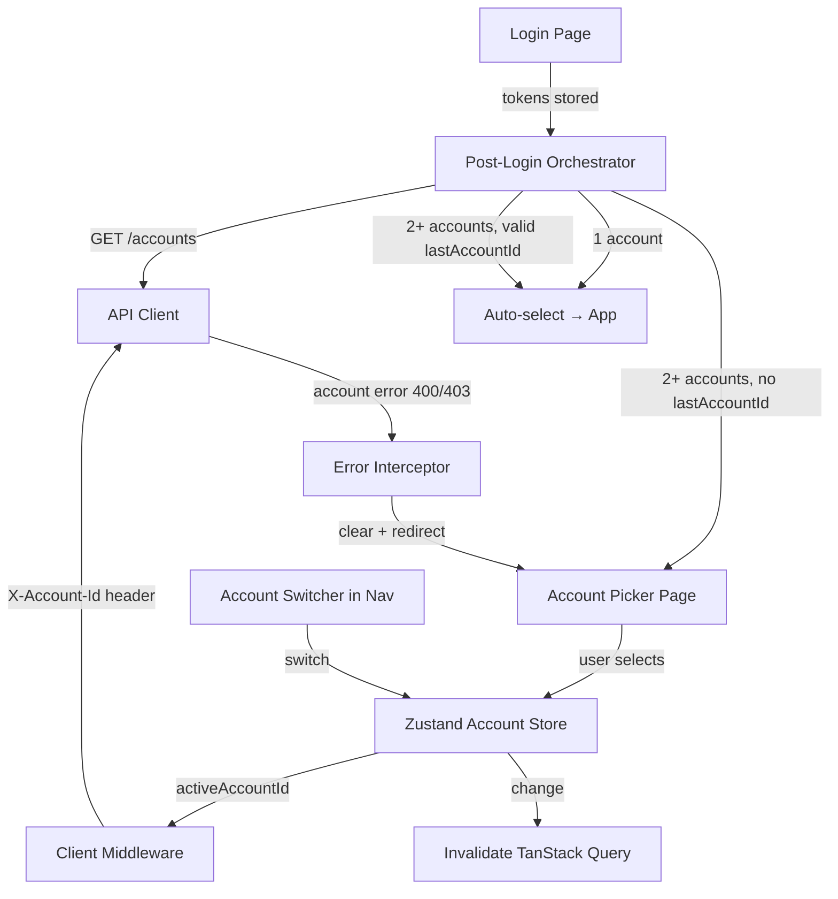

# Design Document: Multi-Account Integration

## Overview

This feature adds multi-account support to the frontend SPA. The backend now requires an `X-Account-Id` header on all authenticated requests (except auth and account-listing endpoints). The frontend must:

1. Fetch the user's account list after login
2. Auto-select or prompt account choice
3. Inject the active account ID into all API requests via middleware
4. Provide an account switcher in navigation for multi-account users
5. Handle account-context errors (removed from account, invalid ID)
6. Clean up account state on logout

The design integrates with the existing `openapi-fetch` middleware pipeline, Zustand for UI state, TanStack Query for server state, and React Router for navigation orchestration.

## Architecture



### Key Design Decisions

1. **Zustand store for account state** — The active account ID is UI-only state (not server-derived). It drives header injection and must be synchronously readable by the middleware. Zustand's `getState()` is ideal here.

2. **Middleware-based header injection** — The existing `openapi-fetch` `client.use()` pipeline already handles auth tokens. Adding `X-Account-Id` in the same `onRequest` hook keeps all header logic co-located.

3. **Route-level orchestration** — A new `/select-account` route handles the post-login flow. The `ProtectedRoute` wrapper is extended to gate on `activeAccountId` being set, redirecting to the picker when needed.

4. **Error interceptor in `onResponse`** — Account errors (400 missing/invalid, 403 not_a_member) are caught in the existing response middleware, preventing error propagation to individual queries.

## Components and Interfaces

### 1. Account Store (`src/stores/account-store.ts`)

```typescript
import { create } from "zustand"

interface AccountItem {
  id: string
  name: string
  role: string
  isOwner: boolean
}

interface AccountState {
  activeAccountId: string | null
  accounts: AccountItem[]
  setActiveAccount: (id: string) => void
  setAccounts: (accounts: AccountItem[]) => void
  clearAccountState: () => void
}
```

- `setActiveAccount` writes to both Zustand state and `localStorage.lastAccountId`
- `clearAccountState` nulls the ID, empties the list, removes `lastAccountId` from localStorage
- Store is read synchronously via `useAccountStore.getState()` in middleware

### 2. API Client Middleware Extension (`src/api/client.ts`)

The existing `onRequest` hook is extended to inject `X-Account-Id`:

```typescript
// Inside the existing client.use() onRequest:
const url = new URL(request.url)
const isAuthPath = url.pathname.startsWith("/auth/")
const isAccountsList = url.pathname === "/accounts" && request.method === "GET"

if (!isAuthPath && !isAccountsList) {
  const accountId = useAccountStore.getState().activeAccountId
  if (accountId) {
    request.headers.set("X-Account-Id", accountId)
  }
}
```

The `onResponse` hook is extended to intercept account errors:

```typescript
// After 401 handling:
if (response.status === 400 || response.status === 403) {
  const body = await response.clone().json()
  const accountErrors = ["missing_account_id", "invalid_account_id", "not_a_member"]
  if (body?.type && accountErrors.includes(body.type)) {
    useAccountStore.getState().clearAccountState()
    queryClient.invalidateQueries()
    window.location.href = "/select-account"
    return response
  }
}
```

### 3. Post-Login Flow (`src/pages/app/select-account.tsx`)

A route-level page component that orchestrates account resolution:

```typescript
// Logic flow:
// 1. Fetch GET /accounts
// 2. If error or empty → clearAuth() → redirect /login
// 3. If 1 account → setActiveAccount(accounts[0].id) → navigate("/")
// 4. If 2+ accounts:
//    a. Check localStorage.lastAccountId
//    b. If valid UUID and in list → auto-select → navigate("/")
//    c. Otherwise → render Account Picker UI
```

This page is accessible at `/select-account` and is protected (requires auth tokens but not an active account).

### 4. Account Picker Component (`src/components/account/account-picker.tsx`)

Full-page card UI rendered within the select-account page:

```typescript
interface AccountPickerProps {
  accounts: AccountItem[]
  onSelect: (accountId: string) => void
}
```

- Renders a card list of accounts
- Each card shows: account name, role badge, "Personal" badge if `isOwner`
- Clicking a card calls `onSelect`
- Uses shadcn/ui Card, Badge components
- Centered layout, similar to auth pages (uses `AuthLayout` wrapper)

### 5. Account Switcher (`src/components/layout/account-switcher.tsx`)

A dropdown in the PillNav, shown only when `accounts.length >= 2`:

```typescript
interface AccountSwitcherProps {
  accounts: AccountItem[]
  activeAccountId: string
  onSwitch: (accountId: string) => void
}
```

- Displays current account name (truncated to 24 chars with ellipsis)
- Dropdown lists all accounts with role + "Personal" badge
- Active account has a check mark or highlighted bg
- On switch: update store, invalidate all queries, close dropdown
- Uses `useRef` + outside-click listener per project patterns

### 6. Protected Route Extension

The existing `ProtectedRoute` adds a check: after authentication succeeds, if no `activeAccountId` is set, redirect to `/select-account`.

### 7. Logout Integration

The existing `handleLogout` in PillNav and `clearAuth()` are extended:

```typescript
function handleLogout() {
  clearAuth()
  useAccountStore.getState().clearAccountState()
  queryClient.clear()
  navigate("/login")
}
```

## Data Models

### AccountListItem (from API)

```typescript
// Generated from openapi.json — do NOT hand-write
interface AccountListItem {
  id: string
  name: string
  role: string      // "user" | "manager" | "admin"
  isOwner: boolean
}
```

### Zustand Store Shape

```typescript
{
  activeAccountId: string | null,    // UUID or null
  accounts: AccountListItem[],       // populated after GET /accounts
}
```

### localStorage Keys

| Key | Value | Lifecycle |
|-----|-------|-----------|
| `lastAccountId` | UUID string | Set on account selection, removed on logout or account error |

### Route Changes

| Route | Component | Auth Required | Account Required |
|-------|-----------|---------------|------------------|
| `/select-account` | SelectAccountPage | Yes | No |
| All other `/` routes | (existing) | Yes | Yes |


## Correctness Properties

*A property is a characteristic or behavior that should hold true across all valid executions of a system—essentially, a formal statement about what the system should do. Properties serve as the bridge between human-readable specifications and machine-verifiable correctness guarantees.*

### Property 1: Account Resolution Logic

*For any* accounts list and any localStorage state (absent, invalid UUID, valid UUID matching/not-matching the list), the `resolveAccount` function SHALL return:
- `{ action: "autoSelect", accountId }` when the list has exactly 1 account
- `{ action: "autoSelect", accountId }` when the list has 2+ accounts and `lastAccountId` is a valid UUID present in the list
- `{ action: "showPicker" }` when the list has 2+ accounts and `lastAccountId` is absent, not a valid UUID, or not present in the list

**Validates: Requirements 2.1, 2.2, 2.3, 3.1, 4.1, 4.2, 4.3, 4.4**

### Property 2: Store setActiveAccount Persists Correctly

*For any* valid UUID string, calling `setActiveAccount(id)` SHALL result in `activeAccountId` equaling that UUID in state AND `localStorage.getItem("lastAccountId")` equaling the same UUID.

**Validates: Requirements 3.4, 3.5, 6.6, 6.7**

### Property 3: Account Picker Renders All Account Information

*For any* array of `AccountListItem` objects, the rendered Account Picker SHALL contain the name and role of every account in the array, and SHALL display a "Personal" badge if and only if the account's `isOwner` field is `true`.

**Validates: Requirements 3.2, 3.3**

### Property 4: Header Injection Rule

*For any* HTTP request and any account store state, the `X-Account-Id` header SHALL be present on the request if and only if: (a) `activeAccountId` is non-null, AND (b) the request path does not start with `/auth/`, AND (c) the request is not `GET /accounts`.

**Validates: Requirements 5.1, 5.2, 5.3, 5.4**

### Property 5: Account Switcher Visibility

*For any* accounts list, the Account Switcher component SHALL render if and only if the list contains two or more accounts.

**Validates: Requirements 6.1, 6.2**

### Property 6: Account Name Truncation

*For any* string, the displayed account name in the Account Switcher SHALL equal the full string when its length is ≤ 24 characters, and SHALL equal the first 24 characters followed by "…" when its length exceeds 24 characters.

**Validates: Requirements 6.3**

### Property 7: Account Switcher Renders All Account Information

*For any* array of `AccountListItem` objects and any `activeAccountId`, the opened Account Switcher SHALL contain the name and role of every account, SHALL display a "Personal" badge if and only if `isOwner` is `true`, and SHALL visually distinguish the account whose `id` matches `activeAccountId`.

**Validates: Requirements 6.4, 6.5**

### Property 8: Error Interceptor Detection

*For any* HTTP response, the error interceptor SHALL identify it as an account error if and only if: the response status is 400 with body type `"missing_account_id"` or `"invalid_account_id"`, OR the response status is 403 with body type `"not_a_member"`. All other status/type combinations SHALL NOT trigger account error handling.

**Validates: Requirements 7.1, 7.2, 7.3**

## Error Handling

### Account Error Responses

| Status | Body Type | Action |
|--------|-----------|--------|
| 400 | `missing_account_id` | Clear account state, invalidate queries, redirect to `/select-account` |
| 400 | `invalid_account_id` | Clear account state, invalidate queries, redirect to `/select-account` |
| 403 | `not_a_member` | Clear account state, invalidate queries, redirect to `/select-account` |

### Deduplication

Multiple concurrent requests may fail with account errors simultaneously. The interceptor uses a guard flag (`isHandlingAccountError`) to ensure only one redirect occurs per error cycle. The flag resets after navigation completes.

### Recovery Flow

1. User is redirected to `/select-account`
2. Page re-fetches `GET /accounts` (account list may have changed)
3. If fetch fails → display inline error with "Retry" button
4. If fetch succeeds → run normal resolution logic (auto-select or show picker)

### Other Error Paths

| Scenario | Handling |
|----------|----------|
| `GET /accounts` fails on initial login | Clear auth tokens, redirect to `/login` |
| `GET /accounts` returns empty array | Clear auth tokens, redirect to `/login` |
| Network error during account fetch | Same as non-2xx — clear auth, redirect to `/login` |

## Testing Strategy

### Property-Based Tests (Vitest + fast-check)

Library: `fast-check` (mature PBT library for TypeScript/Vitest)
Configuration: minimum 100 iterations per property

Each property test references its design property:
- **Feature: multi-account-integration, Property 1: Account resolution logic**
- **Feature: multi-account-integration, Property 2: Store setActiveAccount persists correctly**
- **Feature: multi-account-integration, Property 3: Account picker renders all account information**
- **Feature: multi-account-integration, Property 4: Header injection rule**
- **Feature: multi-account-integration, Property 5: Account switcher visibility**
- **Feature: multi-account-integration, Property 6: Account name truncation**
- **Feature: multi-account-integration, Property 7: Account switcher renders all account information**
- **Feature: multi-account-integration, Property 8: Error interceptor detection**

### Unit Tests (Vitest + React Testing Library)

- Post-login orchestration: loading state, error redirects, empty array handling
- Account picker: selection triggers callback, keyboard navigation
- Account switcher: outside-click closes, switch triggers invalidation
- Logout cleanup: verifies all state cleared
- 401 retry includes X-Account-Id header

### Integration Tests

- Full login → account resolution → app navigation flow
- Account switch → query invalidation → data refetch
- Error interceptor → redirect → recovery → re-selection

### Test File Locations

```
src/stores/__tests__/account-store.test.ts          — Property 1, 2
src/components/account/__tests__/account-picker.test.tsx — Property 3
src/api/__tests__/account-middleware.test.ts         — Property 4, 8
src/components/layout/__tests__/account-switcher.test.tsx — Property 5, 6, 7
src/pages/app/__tests__/select-account.test.tsx      — unit/integration tests
```
