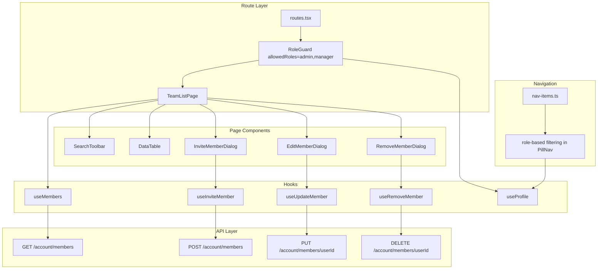

# Design Document: Team Management

## Overview

The team management feature adds a `/team` route where admins and managers can view account members, and admins can invite, edit, and remove them. The implementation follows existing patterns: `SearchToolbar` + `DataTable` for the list, modal dialogs for invite/edit, and a confirmation dialog for removal. A new `RoleGuard` component provides route-level access control, while nav filtering hides the Team link from unauthorized roles.

Key constraints:
- Three roles: user → manager → admin (hierarchical, no "owner")
- Admin-only write actions (invite, edit, remove)
- Manager gets read-only view; user is fully blocked
- API returns 409 when attempting to demote/remove the last admin
- Financial fields (costRate, utilizationTarget, weeklyCapacityHours) visible only to admins
- Small teams (≤5 members), no pagination needed

## Architecture



### Design Decisions

1. **RoleGuard as wrapper component** — Wraps around the route children (not a HOC) to match the existing `ProtectedRoute` pattern. Checks `useProfile()` role against an `allowedRoles` prop.

2. **Single page, no sub-routes** — The team list is simple enough for one page with modals. Matches the projects-list pattern.

3. **Client-side search filtering** — With ≤5 members, filtering in-memory via `useState` is simpler than a query param approach. No debounce needed at this scale.

4. **Conditional column rendering** — Financial columns are included in the DataTable column definition only when the current user is admin. This avoids rendering empty columns for managers.

5. **Reuse delete-confirm-dialog pattern** — The `RemoveMemberDialog` follows the same structure: show context, confirm destructive action, handle error inline.

## Components and Interfaces

### New Components

| Component | Location | Purpose |
|-----------|----------|---------|
| `RoleGuard` | `src/components/auth/role-guard.tsx` | Route-level access control by role |
| `TeamListPage` | `src/pages/app/team-list.tsx` | Main team page with list + toolbar |
| `InviteMemberDialog` | `src/components/team/invite-member-dialog.tsx` | Modal form for email + role invite |
| `EditMemberDialog` | `src/components/team/edit-member-dialog.tsx` | Modal form for editing member details |
| `RemoveMemberDialog` | `src/components/team/remove-member-dialog.tsx` | Confirmation dialog for member removal |

### New Hooks

| Hook | Location | Purpose |
|------|----------|---------|
| `useMembers` | `src/hooks/use-members.ts` | Fetches `GET /account/members` |
| `useInviteMember` | `src/hooks/use-members.ts` | Mutation for `POST /account/members` |
| `useUpdateMember` | `src/hooks/use-members.ts` | Mutation for `PUT /account/members/{userId}` |
| `useRemoveMember` | `src/hooks/use-members.ts` | Mutation for `DELETE /account/members/{userId}` |

### Modified Files

| File | Change |
|------|--------|
| `src/routes.tsx` | Add `/team` route wrapped in `RoleGuard` |
| `src/components/layout/nav-items.ts` | Remove `disabled: true` from Team item, add `minRole` field |
| `src/components/layout/pill-nav.tsx` | Filter nav items by role using `useProfile()` |

### Component Interfaces

```typescript
// role-guard.tsx
interface RoleGuardProps {
  allowedRoles: string[]
  children: React.ReactNode
}

// invite-member-dialog.tsx
interface InviteMemberDialogProps {
  open: boolean
  onClose: () => void
}

// edit-member-dialog.tsx
interface EditMemberDialogProps {
  member: MemberResponse | null
  open: boolean
  onClose: () => void
}

// remove-member-dialog.tsx
interface RemoveMemberDialogProps {
  member: MemberResponse | null
  open: boolean
  onClose: () => void
}
```

### RoleGuard Behavior

```typescript
function RoleGuard({ allowedRoles, children }: RoleGuardProps) {
  const { data: profile, isLoading } = useProfile()

  // Fail-closed: show nothing while loading
  if (isLoading || !profile) return null

  // Redirect unauthorized roles
  if (!allowedRoles.includes(profile.role)) {
    return <Navigate to="/" replace />
  }

  return <>{children}</>
}
```

## Data Models

### API Types (from generated schema)

```typescript
// components["schemas"]["MemberResponse"]
interface MemberResponse {
  id: string
  email: string
  displayName: string | null
  timezone: string | null
  role: string
  joinedAt: string | null       // null = pending invite
  costRate: number | null
  utilizationTarget: number | null
  weeklyCapacityHours: number | null
}

// components["schemas"]["MemberInviteRequest"]
interface MemberInviteRequest {
  email: string
  role?: string | null  // defaults to "user"
}

// components["schemas"]["MemberUpdateRequest"]
interface MemberUpdateRequest {
  role?: string | null
  costRate?: number | null
  utilizationTarget?: number | null
  weeklyCapacityHours?: number | null
}
```

### Zod Schemas (for form validation)

```typescript
// Invite form
const inviteFormSchema = z.object({
  email: z.string().email("Enter a valid email address").max(254, "Email must be 254 characters or less"),
  role: z.enum(["admin", "manager", "user"]),
})

// Edit form
const editFormSchema = z.object({
  role: z.enum(["admin", "manager", "user"]),
  costRate: z.union([
    z.literal(""),
    z.coerce.number().min(0).max(999999.99)
      .refine((v) => Number((v % 1).toFixed(2)) === v % 1, "At most 2 decimal places"),
  ]).transform((v) => v === "" ? null : v),
  utilizationTarget: z.union([
    z.literal(""),
    z.coerce.number().int("Must be a whole number").min(0).max(100),
  ]).transform((v) => v === "" ? null : v),
  weeklyCapacityHours: z.union([
    z.literal(""),
    z.coerce.number().min(0).max(168)
      .refine((v) => Number((v % 1).toFixed(2)) === v % 1, "At most 2 decimal places"),
  ]).transform((v) => v === "" ? null : v),
})
```

### Query Keys

```typescript
const MEMBERS_KEY = ["members"] as const
// Mutations invalidate MEMBERS_KEY on success
```

### Role Constants

```typescript
const ROLES = ["user", "manager", "admin"] as const
type Role = (typeof ROLES)[number]

const ALLOWED_TEAM_VIEW_ROLES: Role[] = ["admin", "manager"]
const ALLOWED_TEAM_WRITE_ROLES: Role[] = ["admin"]
```


## Correctness Properties

*A property is a characteristic or behavior that should hold true across all valid executions of a system — essentially, a formal statement about what the system should do. Properties serve as the bridge between human-readable specifications and machine-verifiable correctness guarantees.*

### Property 1: Display name fallback

*For any* member, the displayed name in the members list should equal `displayName` when it is non-null, and should equal `email` when `displayName` is null.

**Validates: Requirements 1.2**

### Property 2: Pending badge maps to null joinedAt

*For any* member, a "Pending" badge is displayed if and only if `joinedAt` is null.

**Validates: Requirements 1.3**

### Property 3: "You" badge maps to profile ID match

*For any* member list and current user profile, exactly the member whose `id` equals the profile's `id` receives the "You" badge, and no other member does.

**Validates: Requirements 1.4**

### Property 4: Search filter correctness

*For any* list of members and any search string, the filtered result contains exactly those members whose `displayName` or `email` includes the search string as a case-insensitive substring.

**Validates: Requirements 1.5**

### Property 5: Financial field visibility is role-gated

*For any* member data, when the current user's role is "admin" the financial columns (costRate, utilizationTarget, weeklyCapacityHours) are present, and when the role is "manager" they are absent.

**Validates: Requirements 1.9**

### Property 6: Email validation rejects invalid formats

*For any* string that does not conform to standard email format (user@domain) or exceeds 254 characters, the invite form schema rejects it. *For any* valid email ≤254 characters, the schema accepts it.

**Validates: Requirements 2.4, 7.1**

### Property 7: Edit form schema validates field constraints

*For any* set of edit form inputs: the schema accepts if and only if role is one of {"admin", "manager", "user"}, costRate (when non-empty) is a number in [0, 999999.99] with ≤2 decimal places, utilizationTarget (when non-empty) is an integer in [0, 100], and weeklyCapacityHours (when non-empty) is a number in [0, 168] with ≤2 decimal places. Empty optional fields are accepted as null.

**Validates: Requirements 3.3, 6.1, 6.2, 6.3, 6.4, 6.6**

### Property 8: Edit dialog pre-populates with member data

*For any* member (with varying nullable fields), when the edit dialog opens for that member, each form field's initial value matches the corresponding member property (with null fields rendered as empty inputs).

**Validates: Requirements 3.2**

### Property 9: Remove action excludes current user

*For any* member list where the current user has admin role, the remove action appears on every member row except the row whose `id` matches the current user's profile `id`.

**Validates: Requirements 4.1**

### Property 10: Nav item visibility respects role

*For any* user role, the "Team" navigation item is visible if and only if the role is in the allowed set {"admin", "manager"}.

**Validates: Requirements 5.2**

## Error Handling

### API Error Mapping

| HTTP Status | Context | User-Facing Message |
|-------------|---------|---------------------|
| 409 | Invite | "This email is already a member of the account." |
| 409 | Edit (last admin) | "Cannot change role — this is the last admin on the account." |
| 409 | Remove (last admin) | "Cannot remove — this is the last admin on the account." |
| 403 | Any write | "You don't have permission to perform this action." |
| 422 | Invite/Edit | Display API validation message directly |
| 400 | Edit | "The submitted data is invalid. Please check your entries." |
| 5xx / Network | Any | "Something went wrong. Please try again." |

### Error Display Strategy

- **Inline field errors**: Zod validation errors render adjacent to the invalid field (react-hook-form `errors` object).
- **API errors**: Displayed as a banner at the bottom of the dialog form (same pattern as `entry-modal.tsx`).
- **List fetch error**: Replaces the DataTable with an error message in the page body.
- **Form data preservation**: On API error, form data is never cleared — the user can retry or edit.

### Loading States

- **Members list**: `LoadingSpinner` component while query is pending (same as other pages).
- **Dialog submission**: Submit button shows "Saving..." / "Inviting..." / "Removing..." text and is disabled during mutation.
- **Remove dialog**: Both confirm and cancel buttons disabled during DELETE request.

## Testing Strategy

### Unit Tests (Vitest + React Testing Library)

Focus on specific examples and integration points:

- RoleGuard redirects "user" role to `/`
- RoleGuard renders children for "admin" and "manager"
- RoleGuard shows nothing while profile is loading
- Invite dialog opens with default role "user"
- Invite dialog closes on successful submit
- Edit dialog shows correct error for 409 response
- Remove dialog disables buttons during pending request
- Remove dialog re-enables buttons on error
- Nav item hidden for "user" role

### Property Tests (Vitest + fast-check)

Each property test runs minimum 100 iterations using `fast-check` for random input generation.

| Property | Generator Strategy |
|----------|-------------------|
| P1: Display name fallback | Random `{ displayName: string \| null, email: string }` |
| P2: Pending badge | Random `{ joinedAt: string \| null }` |
| P3: "You" badge | Random member arrays + random profile ID (sometimes matching) |
| P4: Search filter | Random member arrays + random substrings / non-matching strings |
| P5: Financial visibility | Random member data × role ∈ {"admin", "manager"} |
| P6: Email validation | Random strings (valid emails, invalid formats, overlength) |
| P7: Edit form validation | Random numeric values (in-range, out-of-range, wrong decimals) × random role strings |
| P8: Edit dialog pre-population | Random members with nullable fields |
| P9: Remove excludes self | Random member arrays + random current user ID |
| P10: Nav visibility | Role ∈ {"user", "manager", "admin"} × expected visibility |

Each test is tagged: **Feature: team-management, Property {N}: {title}**

### Integration Tests

- Full page render with mocked API: verify list renders, search filters, dialogs open/close
- Mutation flows: invite → invalidates members query, edit → invalidates, remove → invalidates

### What's NOT Tested with PBT

- API error handling (specific status codes → specific messages) — example-based unit tests
- Loading states — example-based
- Dialog open/close mechanics — example-based
- Route navigation and redirects — example-based
